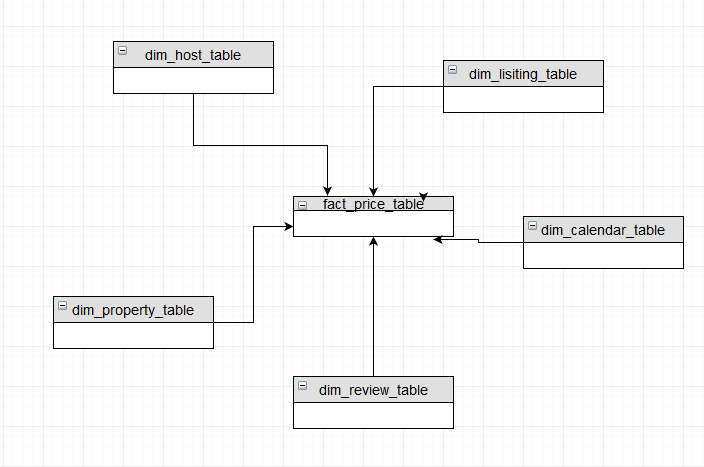

 
# Airbnb data modeling for listing popularity analysis - NYC 

## Objective
Airbnb is an onine business platform that provides an opportunity to link apartment owners(hosts) and the guests. Anybody with an open room or free space can become a host on Airbnb. It is a good way to provide extra income with minimal effort. It is an easy way to advertise space because the platform has the traffic and a global user base to support it. 


## Scope

The scope of this project is to use airbnb open data available at kaggle for New York city and to create a suitable data model which can be used by data analysts as well as other business decision makers. The expected output will be for such decision maker to be able to extract out different factors and predict what drives the higher airbnb accommodation rates. these factors could be season of the year or location of the accommodation. Three data sets are used for this project namely, listing.csv, calendar.csv and finally review.json.

## Dataset

```listings csv``` consists of details of all the listings in NYC including their price, accommodates, ratings, number of reviews, name, owner name, Description, many other columns decribing details of listings.

```calendar.csv``` consists of details of listings and its availability and its price.

```reviews.json``` consist of reviews provided by guests for each listing in NYC


## Approach:
 In order to optimize queries on airbnb price analysis, star schema is used with  fact table(```fact_price_table```) and dimension tables(```dim_host_table, dim_lisiting_table, dim_property_table, dim_calendar_table and dim_review_table```). Star schema has simpler structure which makes it easier to understand and query effectively. The project is done in two main phases:



- ### Phase one: 

    read all three datasets and check if there are attributes with more than 25% of entries are missing, such attributes are dropped out as their reliability is not good enough for decision making purpose. This is done in jupyter notebook with library such as pandas. Once these columns are dropped and we have usable datasets we move to phase two.


### Phase two:
- During this phase Apache airflow is used with dag and different operators.

  * #### Staging

     First for better salability and maintainability files from airbnb raw dataset are now stored in Amazon S3 bucket. The entries from the three dataset are then copied to three redshift staging tables(i.e ```staging_listings, staging_calendar, staging_review```) using ```StageToRedshiftOperator``` operator. 
  * #### creating dim and fact tables

    After having staged data, all the necessary fact and dimension tables with correct data type are created, this is done using a custom operator called ```CreateTableOperator```. 
  * #### Load tables

    once the start schema is created, the data is loded to the corresponding dimension and fact table from staging tables using ```LoadDimensionOperator``` and ```LoadFactOperator``` respectively.

  * #### Data quality check
    As a data quality check ```DataQualityOperator``` used to verify fact table is not empty. this can be used to check any entry in the whole model by changing the table and column name. 


#### Libraries and Tools
- Python - Pandas
- Apache airflow

#### Things to consider before running the project
    - Set correct AWS credentials
    - Set correct redshift credentials
    - have dataset in S3 or point it to the correct path
    
#### Addressing Other Scenarios
- The pipelines would be run on a daily basis by 7 am every day.
  
  * The Airflow scheduler could be used to monitor all tasks and all DAGs, and triggers the task instances whose dependencies have been met.
- For multiple access and large data Amazon's best practice could come handy
  * COPY data from multiple, evenly sized files.
  * Use workload management to improve ETL runtimes.
  * Perform table maintenance regularly.
  * Perform multiple steps in a single transaction.
  * Loading data in bulk...
  
#### Included in the project
  * dags folder with ```udacity_airbnb_final_dag.py``` and jsonpath files
  * ```plugins directory``` which inlcudes the ```operators```, and ```helper``` queries
  * sample csv and json dataset
  * ```readme```


```python

```
